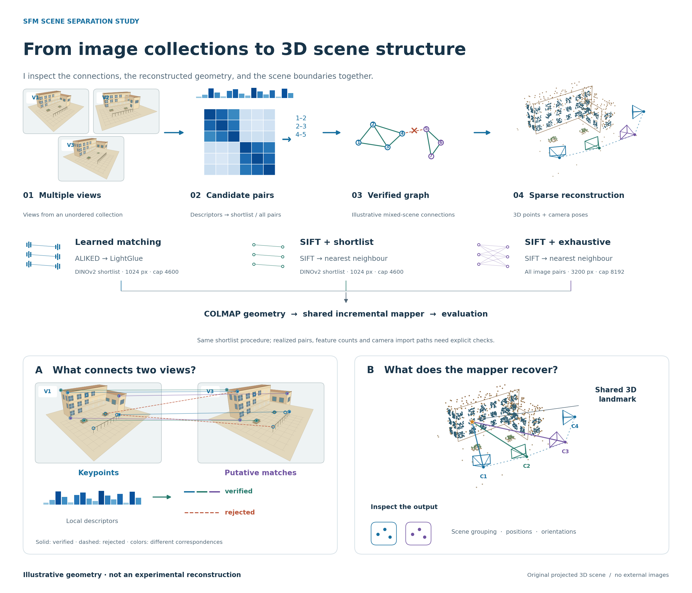
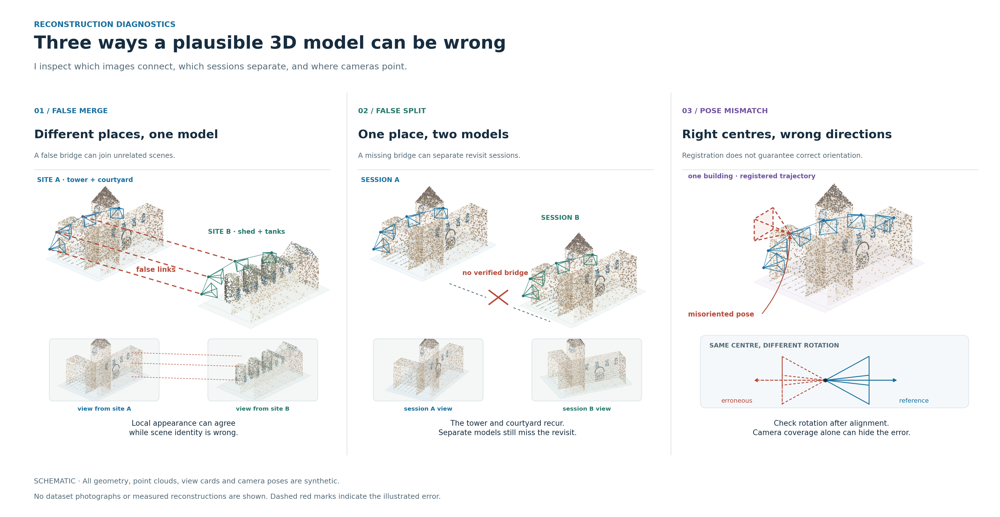
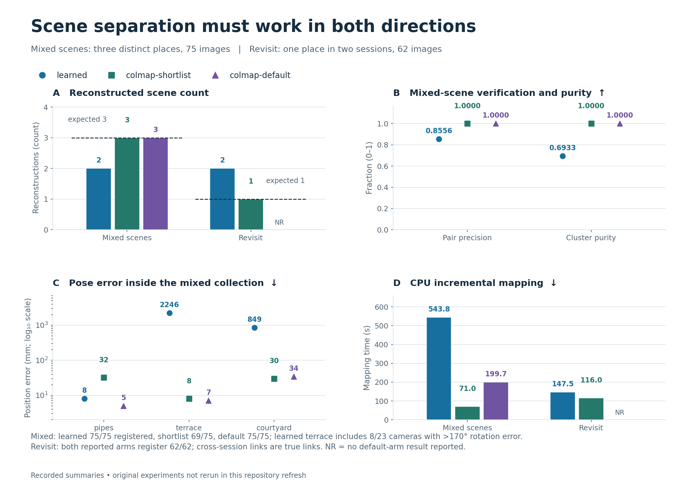
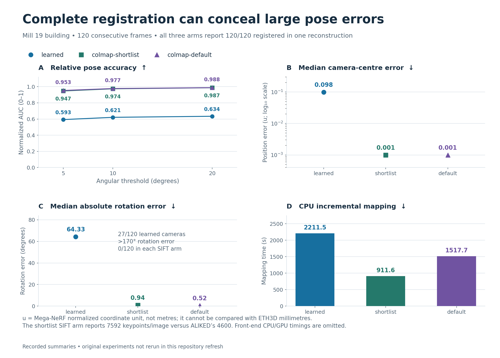
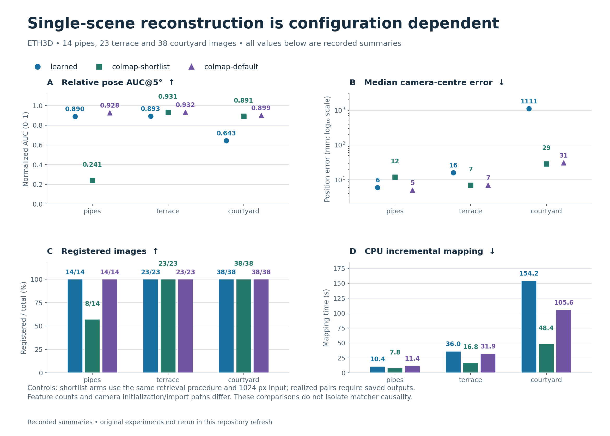

<div align="center">

# SfM Scene Separation Study

### Matching, scene identity, and camera geometry<br>in learned and classical Structure-from-Motion

**Bowen Liu · Individual experiment · Work in progress**

[Method](docs/METHOD.md) · [Results](RESULTS.md) · [Quick start](#quick-start) · [Experiments](docs/EXPERIMENTS.md) · [Roadmap](docs/ROADMAP.md)

**A complete reconstruction can still have the wrong geometry.**

</div>

I independently study how feature matching affects **which images reconstruct together** and **whether their camera poses are correct**. In this individual experiment, I compare a DINOv2 → ALIKED → LightGlue front end with two SIFT + nearest-neighbour baselines, using a shared COLMAP mapping and evaluation path.

My recorded experiments cover individual ETH3D scenes, a mixture of different places, repeated visits to one place, and a 120-frame Mill 19 aerial sequence. They motivate a practical question: what does registration rate miss?

> **Current status.** This is an ongoing study. The figures and tables summarize my previously recorded results; I have not rerun the GPU experiments in this revision. The original per-run logs and reconstruction files are not available in this checkout. I document that evidence gap and the changes required for fresh runs in [the audit](docs/AUDIT.md).

<p align="center">
  
</p>

*I use original illustrative geometry to show what changes between views and what matching must recover. [Full-size figure and editable source](figures/README.md#illustrated-method-from-image-collections-to-3d-scene-structure). The comparison shares a mapper, but changes several front-end components; it does not isolate LightGlue as the cause of a failure.*

## Three questions

| Scene separation | Revisit fusion | Camera geometry |
| :--- | :--- | :--- |
| Do images from different places stay in separate reconstructions? | Do two visits to the same place join into one reconstruction? | Do camera positions and orientations agree with reference poses? |
| `mixed3`: 75 images, 3 places | `revisit`: 62 images, 2 sessions, 1 place | `uav_building`: 120 consecutive frames |

<p align="center">
  
</p>

## Recorded results

### Scene identity and completeness

| Experiment | Expected models | Learned | SIFT / shortlist | SIFT / stock settings |
| :--- | ---: | :--- | :--- | :--- |
| Different places (`mixed3`) | 3 | **2 models**, 75/75 registered | 3 models, 69/75 registered | 3 models, 75/75 registered |
| Same place, two visits (`revisit`) | 1 | **2 models**, 62/62 registered | 1 model, 62/62 registered | Not reported |
| Aerial sequence (`uav_building`) | 1 | 1 model, 120/120 registered | 1 model, 120/120 registered | 1 model, 120/120 registered |

<p align="center">
  
</p>

### The aerial sequence: equal coverage, different poses

| Front end | AUC@5° ↑ | Median rotation ↓ | Median position ↓ | Cameras with rotation error >170° ↓ |
| :--- | ---: | ---: | ---: | ---: |
| Learned | 0.593 | 64.33° | 0.098 u | 27/120 |
| SIFT / shortlist | 0.947 | 0.94° | 0.001 u | 0/120 |
| SIFT / stock settings | 0.953 | 0.52° | 0.001 u | 0/120 |

*`u` denotes the normalized Mill 19 coordinate frame, not metres. The recorded median inter-frame baseline is 0.041 u. These position errors cannot be compared directly with ETH3D millimetres.*

<p align="center">
  
</p>

The common evaluation path makes the SIFT controls informative, but does not by itself validate every pose conversion or isolate one component. I still need repeat runs, matched realized feature budgets, camera-model controls, and checks against independent evaluation code.

<details>
<summary><strong>Single-scene results and the resolution/budget control</strong></summary>

<p align="center">
  
</p>

On `pipes`, learned matching registers 14/14 images, while SIFT / shortlist registers 8/14. SIFT / stock settings also registers 14/14. The stock arm changes resolution, feature cap, and pairing together; this result does not isolate a resolution-only effect.

For `courtyard`, I recorded learned median position errors of 516, 849, and 1111 mm across different runs. The 849 mm value comes from the mixed-scene run, so these are **not three controlled repeats of the same input**. I preserve the values without treating them as a statistical repeatability estimate.

</details>

[All tables, definitions, and timings →](RESULTS.md) · [Reusable result data →](results/reported/README.md) · [Figure sources and descriptions →](figures/README.md)

## How the comparison works

| Configuration | Candidate pairs | Features + matcher | Nominal settings |
| :--- | :--- | :--- | :--- |
| `learned` | DINOv2 shortlist | ALIKED + LightGlue | 1024 px; cap 4600 |
| `colmap-shortlist` | DINOv2 shortlist | SIFT + nearest neighbour / ratio test | 1024 px; cap 4600 |
| `colmap-default` | Exhaustive | SIFT + nearest neighbour / ratio test | 3200 px; cap 8192 |

I hold the mapping entry point and evaluation definitions in common. The first two arms use the same shortlisting procedure and nominal resolution/cap, but realized keypoint counts and camera initialization differ. The stock-setting arm is a broader baseline, not a one-variable ablation. [Controlled and uncontrolled variables →](docs/METHOD.md)

## Quick start

The commands below are for my own work and separately authorized collaborators; they do not grant permission to reuse the repository. [Rights and permissions →](LICENSE)

Inspect the command interface and run the lightweight regression checks without downloading datasets or model weights:

```bash
python -m venv .venv
source .venv/bin/activate
python -m pip install -r requirements-dev.txt
python src/run_experiments.py --help
python -m unittest discover -s tests -v
python tools/validate_repository.py
```

For reconstruction dependencies, data preparation, and a first experiment, see [Getting started](docs/GETTING_STARTED.md). GPU experiments are separate from the lightweight checks above.

## Documentation

| Guide | Contents |
| :--- | :--- |
| [Method](docs/METHOD.md) | Pipeline, controls, pose conventions, metric definitions |
| [Getting started](docs/GETTING_STARTED.md) | Installation, smoke checks, first run |
| [Experiments](docs/EXPERIMENTS.md) | Commands, configurations, run outputs, ablations |
| [Data and references](docs/DATA_SOURCES.md) | Dataset layout, upstream resources, attribution |
| [Results](RESULTS.md) | Historical tables with evidence and unit boundaries |
| [Audit](docs/AUDIT.md) | File review, corrections, unresolved evidence gaps |
| [Porting notes](docs/porting-notes.md) | Historical API migration and environment observations |
| [Roadmap](docs/ROADMAP.md) | Implemented work and open research tasks |

<details>
<summary><strong>Repository structure</strong></summary>

```text
src/                 Front ends, dataset preparation, mapping, evaluation
tests/               Lightweight regression tests
results/reported/    Machine-readable historical summaries and provenance
figures/             Editable diagrams and result plots; PNG previews
figures/archive/     Earlier figures retained with their evidence caveats
tools/               Figure generation and repository validation
docs/                Method, reproduction, audit, and research roadmap
```

</details>


## Acknowledgements and rights

I build on DINOv2, ALIKED, LightGlue, COLMAP/pycolmap, ETH3D, and Mill 19/Mega-NeRF. I keep their datasets, model weights, and licenses separate from my repository terms. [Sources and attribution →](docs/DATA_SOURCES.md)

**All rights reserved for new original material in this revision.** No general reuse license is granted. Material previously distributed under MIT remains subject to that grant; I preserve its notice in [LICENSES/MIT-legacy.txt](LICENSES/MIT-legacy.txt). See [LICENSE](LICENSE) and [licensing scope](docs/LICENSING.md).
