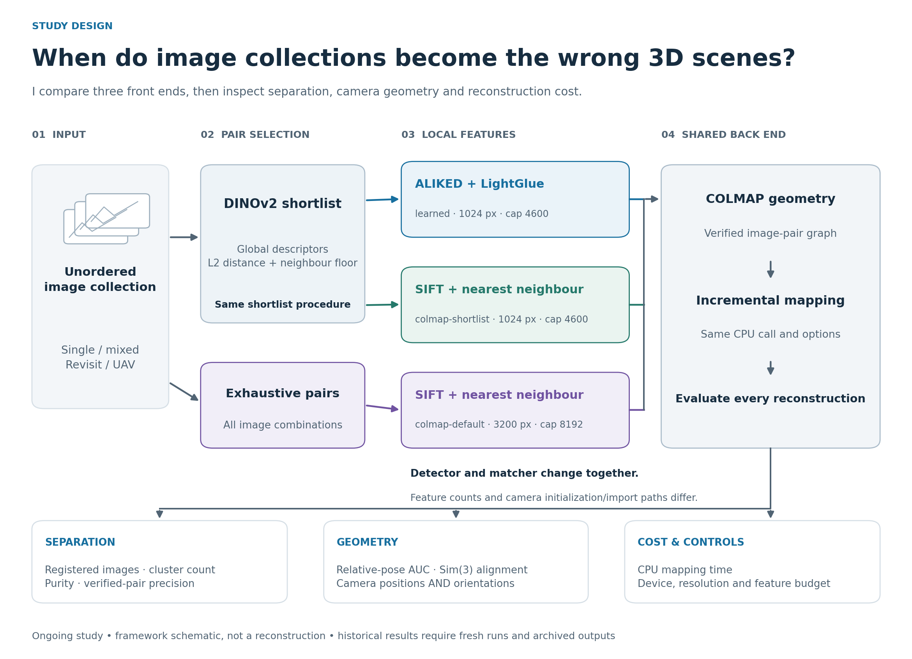

# Method and evaluation

[Overview](../README.md) · [Recorded results](../RESULTS.md) · [Experiment guide](EXPERIMENTS.md)

I study sparse Structure-from-Motion (SfM): estimating camera poses and a sparse set of 3D points from overlapping images. My central questions concern scene grouping and pose accuracy. This repository does not implement a dense multi-view stereo or mesh-production pipeline.

## 1. Select image pairs

For the learned and shortlist-SIFT arms, I encode images with `facebook/dinov2-base`, pool and normalize the descriptors, and compute descriptor distances. I select candidate pairs by a distance threshold and a minimum-neighbour rule, then deduplicate undirected pairs. Despite its historical name, `--sim-th` is a **distance threshold**, not a cosine-similarity cutoff.

The stock-setting SIFT arm uses exhaustive pairing. For N images this is N(N−1)/2 pairs. At N=12,000 the count is 71,994,000. This is a combinatorial calculation, not a measured experiment here. The current retrieval implementation also allocates an N-by-N distance matrix and needs further work for large collections.

The `corrected` shortlist policy excludes self matches and queries every image. The `legacy` policy retains the old self-counting and omitted-final-query behavior for diagnostics. Historical table values were produced before these corrections; identical settings alone do not reproduce their pair sets.

## 2. Detect and match local features

| Arm | Detector / descriptor | Matcher | Resolution and cap |
| :--- | :--- | :--- | :--- |
| `learned` | ALIKED | LightGlue | Configurable; defaults 1024 px / 4600 |
| `colmap-shortlist` | COLMAP SIFT | Nearest neighbour with ratio test | Configurable; defaults 1024 px / 4600 |
| `colmap-default` | COLMAP SIFT | Nearest neighbour with ratio test | Stock-setting constants 3200 px / 8192 |

The learned path stores features and matches in HDF5 before importing them into a COLMAP database. It creates independent `SIMPLE_PINHOLE` cameras with a focal prior of 1.2 times the larger image dimension. The SIFT path uses COLMAP's native image/feature import. Their camera initialization paths are not yet harmonized.

A configured cap does not guarantee equal realized feature counts. The historical SIFT counts differ by scene and arm; I report those differences in [RESULTS](../RESULTS.md). No claim here requires interpreting ALIKED's cap as an unconditional API guarantee.

## 3. Verify and reconstruct

I geometrically verify image-pair correspondences, then run `pycolmap.incremental_mapping` on the resulting database. A verified two-view relation is local evidence of geometric consistency; it does not establish that two image collections belong to the same physical place.

The `--min-inliers` option removes verified edges below a threshold and reruns mapping. This is a post-verification graph ablation. It leaves putative matching unchanged, and the filtered database and mapping outputs are saved separately from the original run.

## What is shared, and what is not

| Factor | Comparison status |
| :--- | :--- |
| Input image collection | Shared within each experiment preset |
| Shortlisting code/settings | Shared by learned and shortlist SIFT; new runs save actual pairs |
| Nominal image size / feature cap | Shared by learned and shortlist SIFT |
| Realized number of keypoints | Not matched |
| Detector, descriptors, matcher | Changed together |
| Camera initialization/import path | Different; control remains open |
| Geometric verification path | Must be recorded; learned uses explicit verification in this revision |
| Mapper entry point and option construction | Shared |
| Evaluation code and within-frame grouping | Shared |
| Compute device | Historically CPU SIFT versus GPU learned front end |
| Repeated seeds / timing distributions | Not available for the full historical comparison |

These controls support pipeline-level observations. Isolating detector quality, matcher behavior, or resolution requires additional ablations.

## 4. Evaluate coverage, grouping, and geometry

I use three different labels for three different purposes:

- **Image identity** associates features, poses, and image files.
- **Physical-scene identity** evaluates scene agreement and purity. Both `relief` sessions share this identity.
- **Reference-frame identity** groups poses for evaluation. `relief` and `relief_2` retain separate frames even though they depict the same place.

### Pose convention

I store world-to-camera poses as a 3×3 rotation R and a 3-vector t:

`x_camera = R x_world + t`, with camera centre `C = −Rᵀt`.

COLMAP uses camera axes x right, y down, z forward. Its text representation uses a Hamilton quaternion `(qw, qx, qy, qz)`. See the [official output-format documentation](https://colmap.github.io/format.html#images-txt).

For the available Mill 19 metadata I interpret the stored 3×4 camera-to-world matrix in the NeRF/OpenGL convention. With `F = diag(1, −1, −1)`, I convert using `R = F R_camera_to_worldᵀ` and `t = −R C`. The conversion has algebraic regression tests. Physical validation against image observations remains separate; continuity and orthonormality do not identify a fixed camera-axis flip.

Mill 19 uses dataset-supplied reference poses, not a claim of independently surveyed ground truth. The selected metadata's provenance and any dependence on SfM should be considered when interpreting the comparison.

### Relative-pose AUC

For each unordered image pair within one reference frame, I compute relative rotation error and translation-direction error. Translation error is sign-invariant:

`e_t = arccos(|t̂_pred · t̂_ref|)`, where each t̂ is a unit 3-vector.

The pair error is `max(e_R, e_t)`. Missing poses or pairs split between reconstructed components receive 180°. I integrate the empirical cumulative error curve up to 5°, 10°, and 20°, dividing by the threshold. Higher AUC is better. AUC values depend on these conventions and should not be compared blindly with other implementations.

### Absolute pose errors

I select a scene/session's dominant reconstructed component, align its camera centres to the reference with a similarity transform, and compute median position and SO(3) rotation errors. The alignment estimates translation, rotation, and scale. Missing cameras and smaller components are not represented in those medians; their coverage is reported separately.

ETH3D errors are expressed in millimetres in the historical tables. Mill 19 errors use normalized units `u`; there is no retained conversion to metres. The count above 170° refers to full rotation error and does not establish reversed optical axes.

### Correspondence and scene metrics

- **All-pair inlier ratio:** total verified inliers divided by putative correspondences across all matched pairs, including failed-verification pairs in the denominator.
- **Verified-pair inlier ratio:** the earlier conditional denominator, retained under `inlier_ratio_verified_pairs` for comparison with historical values.
- **Pair precision:** same-physical-scene verified image pairs divided by all verified image pairs. It is not pixel-level ground-truth precision and is uninformative for a single physical scene.
- **Purity:** majority physical-scene count per reconstructed component, summed and divided by registered images. I pair it with registration and expected component count because fragmentation can artificially raise purity.

## Interpretation boundary

I treat the existing results as hypotheses and observations to reproduce. I have not established a universal front-end ranking, a causal explanation for each failure, or production-scale performance. [Audit and corrections](AUDIT.md) · [Planned experiments](ROADMAP.md)
